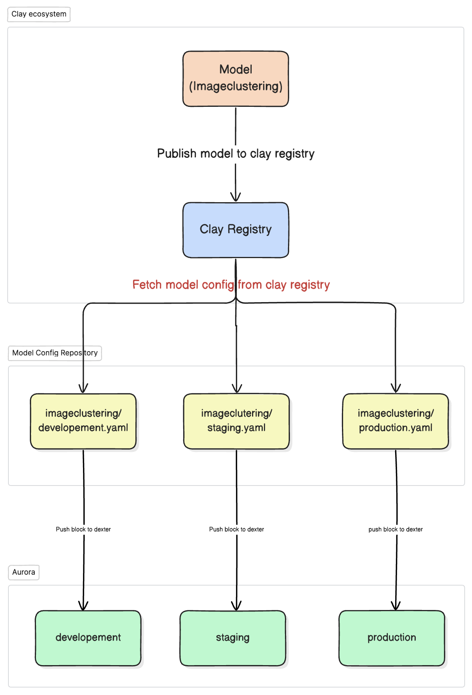
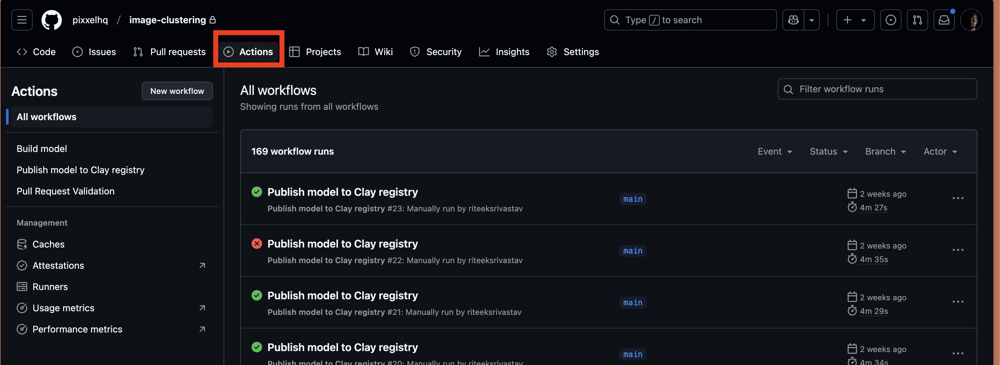
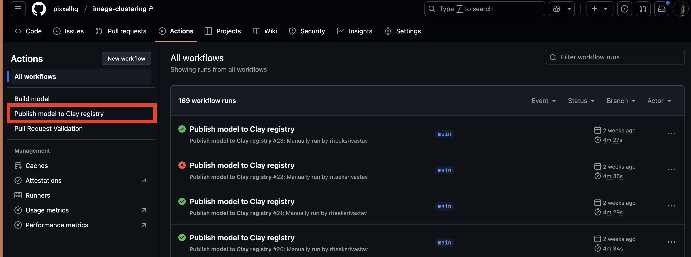
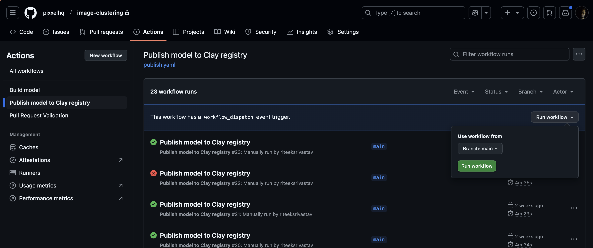
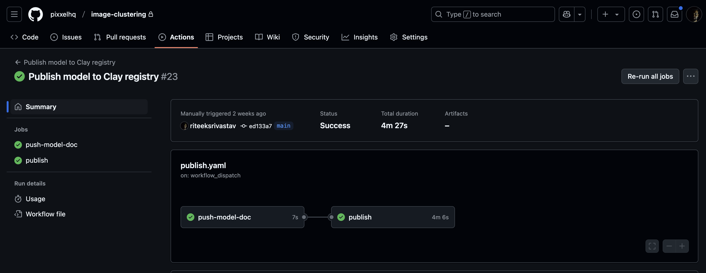
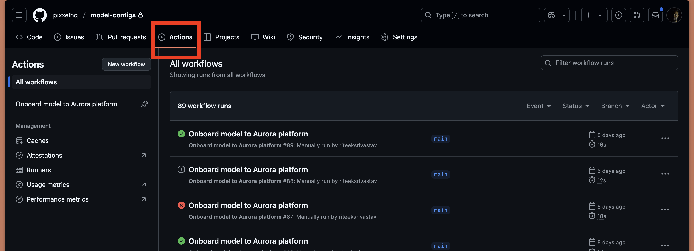
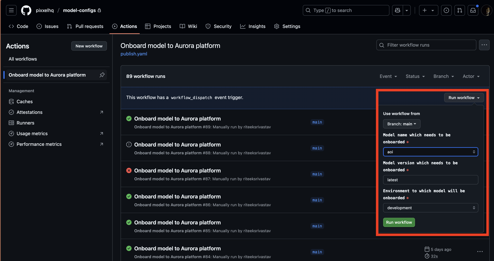

# Getting started

This section will guide you on how to use clay for project setup which will be used for model development.

## Nomenclature
1. `clay` **CLI**: A command line tool which helps in model development by providing project scaffolding, dockerfile and deployment pipeline out of the box.
2. `clay` **Python SDK**: Used in the model development as a python dependency. 

## Prerequisite
* **macOS or Linux**: `clay` CLI is supported in macOS and Linux.
* **Docker**: Docker should be [installed](https://docs.docker.com/get-docker/) in your system. It will be used to build image and create container.
* **python**: You should have python >=3.9 installed in your system
* **git**: `git` should be installed in your system

## Project Setup
### Install clay CLI
`clay` is a private CLI for Pixxel hence we need to do authentication before installation. **You can just follow the commands blindly in chronological order.** 

1. Generate a Personal Access Token (PAT) (classic) on Github. You can follow Github's documentation [here](https://docs.github.com/en/authentication/keeping-your-account-and-data-secure/managing-your-personal-access-tokens#creating-a-personal-access-token-classic).

    * The minimum permissions are `repo`, `write:packages` and `read:packages`.

    !!! warning

        Treat your PAT's like passwords. In other words, be careful!

2. Copy the token and add it as a shell variable `HOMEBREW_GITHUB_API_TOKEN`.
```shell
export HOMEBREW_GITHUB_API_TOKEN=<replace-with-token-here>
```
    * For convenience, you can even add the above command your shell profile (eg: bashrc/zshrc etc), such that you don't have to repeat this step every time.

3. If you are on Linux/Ubuntu and your system doesn't have [Brew](https://brew.sh/), please install brew by following the instruction [here](https://docs.brew.sh/Homebrew-on-Linux).
    * Check if the installation worked by running `brew --version`. It should print something like, `Homebrew 4.2.12`.

4. The following command adds Pixxel's Brew Tap onto your system.
```shell
brew tap example/tap
```

5. Finally, install `Clay`.
```shell
brew install --formula example/tap/clay    
```

6. Run `clay --version` to check and you should be good to go!

7. Use the following command to upgrade already installed clay.
```shell
brew upgrade --formula example/tap/clay
```

8. Try running clay version; it should display the Clay CLI version. If you encounter the error command not found: clay, try running brew link clay and then check the Clay version again.

### Create Project
Let's say our model name is `DemoClay`
The following command would create the project in the current directory by default. If you want to create the project in some other directory, please feel free to provide the directory path instead of `.`

```shell
clay create project . DemoClay
```
Let's go into the `DemoClay` directory
```shell
cd Democlay
```


### Create your Python Virtual Environment

!!! important

    It is highly recommended to have a separate virtual environment for each model under development as it allows us to maintain clean dependency lists.
    
    For this demo we will use `pip` as package manager.

!!! warning

    It is very important to create a fresh virtual env before staring with the project. If you have already active virtual env please deactivate that.

Run the following command to create virtual env
```shell
python3 -m venv venv
```

Activate you venv by running the below command 
```shell
source venv/bin/activate
```

### Setup project 

Run the following command to setup your repository, this will initialize the `git` for you and install all the default dependencies like clay along with linters, formatters etc (mentioned in requirement-dev.txt).

1. Login to the aws using any profile. eg:
```shell
aws sso login --profile=d-platform-services
```

??? Note "Pitfall"

        Depending on how your shell is configured, AWS might not be able detect the credentials. If even after successfully logging in, the AWS CLI is unable to find the creds, export this into your environment, `export AWS_PROFILE=<profile-name>` where <profile-name> is to be replaced with your AWS profile with which you logged in.

2. Run the following command
```shell
make setup
```

### Build and run
1. Update the `build.requirements` field in `clay.yaml` to specify your dependency manager file. By default, it is set to `requirements.txt`. If you use a different file like `conda.yaml`, update `build.requirements` accordingly.


!!! GPU
    In case your model uses GPU please update  `gpu` field to `true` in `clay.yaml`.
    Also for model using GPU, it's recommended to use `conda.yaml` for handling dependencies. Clay utilizes conda for models with GPU support and ensures NVIDIA drivers are installed to enable GPU execution.


2. Run `clay build`. It will create a Dockerfile if it does not exist and then build an image using the `name` and `version` specified in `clay.yaml`. For example, if the `name` is `demomodel` and the `version` is `0.0.1`, a Docker image named `demomodel:0.0.1` will be created.

4. Run dockerfile locally
```shell
clay run demo-clay:v0.0.1 "$(cat demo_clay/sample_model_inputs.json)"
```
the logs should look something like 
```
docker run testmodel "$(cat TestModel/sample_model_inputs.json)"
Using configuration located at: /app/specifications/model_specification_dev.yaml
WARNING - 2024-04-02 09:01:26,122 - job_runner.py:195 - job_model_runner - 'remote-prefix'
INFO - 2024-04-02 09:01:26,123 - core.py:346 - job_model_runner - Initializing model...
INFO - 2024-04-02 09:01:26,125 - core.py:348 - job_model_runner - Model initialization complete.
WARNING - 2024-04-02 09:01:27,130 - core.py:372 - job_model_runner - `ORCHESTRATOR_URL` not set, and hence not firing callback
ERROR - 2024-04-02 09:01:27,131 - job_runner.py:403 - job_model_runner - Failed to fire callback
WARNING - 2024-04-02 09:01:27,133 - model.py:22 - TestModel - In pre-process. Use self.logger for all logging. Avoid print statements
INFO - 2024-04-02 09:01:27,133 - model.py:25 - TestModel - Input1 is starting-point
INFO - 2024-04-02 09:01:27,133 - model.py:31 - TestModel - In inference. I can access all `self` parameters throughout the model
INFO - 2024-04-02 09:01:27,133 - model.py:36 - TestModel - In postprocessing
WARNING - 2024-04-02 09:01:27,138 - core.py:372 - job_model_runner - `ORCHESTRATOR_URL` not set, and hence not firing callback
WARNING - 2024-04-02 09:01:27,138 - job_runner.py:426 - job_model_runner - failed to fire callback successfully
INFO - 2024-04-02 09:01:27,138 - job_runner.py:470 - job_model_runner - results: [Number(Format='number', Type='int', Name='output1', Value=5, Default=None, IsArtifact=False)]
```

5. Time to do the initial commit. Run `git commit -m "feat: initial project setup"`

6. Ta da 🎉🎉🎉, your project setup is done. 

## Deployment
This is the high level flow for model deployment.
    

#### Deploying model to clay registry.
Once you are done with model development please update the version in `clay.yaml` if there is any change in the code. Now it's time for model deployment.
**NOTE:** Clay has a componenet called `registry` which is responsible for storing all the models along with different version.

1. Go to github actions of your repository.

     


2. Click on `Publish model to Clay registry`

     


3. Run the workflow. It will push the model with the version specified in the `clay.yaml` to registry.

    

    The the successfull workflow will look like 

    


4. After successful you can cross check your model on clay registry by following command.
        
    ```shell
        clay block list 
    ```
    
    It should list all the models with latest version, the list should have your model with the version mention in the model's clay.yaml. The same output will look like

    ```json
        (base) ➜  ~ clay block list
        {
          "id": "0b2af1d0-e779-41e7-9ed0-ff901dc6405d",
          "name": "principalcomponentanalysis",
          "kind": "block",
          "type": "processing",
          "version": "v1.3.1",
          "docker_image": "REDACTED.dkr.ecr.us-east-2.amazonaws.com/principalcomponentanalysis:v1.3.1",
          "documentation_url": "https://p-platform-clay-public-catalog-s3-01.s3.us-east-2.amazonaws.com/principalcomponentanalysis/v1.3.1/catalog_readme/parsed.md"
        }
        {
          "id": "0fe70c7a-d41b-4a5e-8dcf-4d4399f1382b",
          "name": "cropparameter",
          "kind": "block",
          "type": "processing",
          "version": "v1.4.1",
          "docker_image": "REDACTED.dkr.ecr.us-east-2.amazonaws.com/cropparameter:v1.4.1",
          "documentation_url": "https://p-platform-clay-public-catalog-s3-01.s3.us-east-2.amazonaws.com/cropparameter/v1.4.1/catalog_readme/parsed.md"
        }
    ```

5. You can futher check the specification of a particular version of your model by running the  following command.
    ```shell
        clay block describe imageclustering --version v1.4.0
    ```
    The sample output will look like:
    ```json
    {
        "id": "50f763e1-a7e5-4a01-acab-f49c918ee287",
        "name": "imageclustering",
        "kind": "block",
        "type": "processing",
        "version": "v0.0.1",
        "docker_image": "REDACTED.dkr.ecr.us-east-2.amazonaws.com/imageclustering:v1.4.0",
        "documentation_url": "https://p-platform-clay-public-catalog-s3-01.s3.us-east-2.amazonaws.com/imageclustering/v1.4.0/catalog_readme/parsed.md",
        "specification": {
          "apiVersion": "0.0.1",
          "title": "",
          "author": "khushil@pixxel.co.in",
          "tags": [
            "imagery",
            "processing"
          ],
          "parameters": null,
          "inputs": [
            {
              "name": "raster",
              "type": "url",
              "format": "raster",
              "properties": null,
              "is_artifact": true
            },
            {
              "name": "k",
              "type": "int",
              "format": "number",
              "default": 8,
              "properties": null,
              "description": "For general land cover analysis, k values between 5 and 10 offer a good balance of detail and interpretability. Higher values (10-15) may be needed for detailed segmentation, but values above 20 risk over-segmentation and complexity.",
              "display_name": "Number of clusters"
            }
          ],
          "outputs": [
            {
              "name": "result",
              "type": "url",
              "format": "raster",
              "properties": null,
              "is_artifact": true
            }
          ],
          "build": {
            "conda": false,
            "apt-get": [
              "wget"
            ],
            "requirements": "requirements.txt",
            "python-version": "3.10"
          },
          "gpu": false
        }
    }   
    ```


#### Onboarding model to Platform platform
Once the model is deployed to clay registry. Please follow the instruction below to onboard your model to Platform platform.
1. Clone the repository [model-config](https://github.com/example/model-configs).

2. Open the directory of your model. e.g. for imageclustering (directory name should same as model name mentioned in your clay.yaml file). The directory will have 3 files.
    a. development.yaml (model config for aurora development)
    b. staging.yaml (model config for aurora staging)
    b. production.yaml (model config for aurora production)
3. Edit or add new environment variable in the respective files/
4. Commit and raise the PR for your changes. Tag @maintainers, @contributor, @contributor to review
5. Once the PR is merged, go to actions.

    

6. Open `Onboard model to Platform platform` action and click on the `Run workflow`.

7. Run workflow.
    a. Select your model from the model name
    b. Mention the version you want to onboard to aurora platform. (Default: `latest` version)
    c. Select the environment in which you want to onboard the model.
    d. Run the workflow

    
