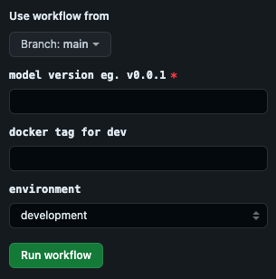

# Model Development
Welcome to our tutorial on creating an NDVI model for Landsat imagery using Clay.

## Prerequisite

Before diving in, ensure you have:

* Set up the project and completed the initial setup as per the instructions in the [Getting Started](getting-started.md) section.
* Familiarity with [Types](types.md) and the [Model Specification Format](spec.md).


## Development

Model development in clay is divided into 4 parts

1. `setup`: Downloads weights and initializes the model.
2. `preprocess`: Preprocesses model inputs if required or do the any validation check which is required for the model input.
3. `inference`: Contains the model's algorithm for inference.
4. `postprocess`: Performs post-processing on the model output if required.

Clay will generate a class with the above mentioned methods you just need to use them for your model development.

??? Interface  
    You will be using `model.py` the repository to develop your model. It will look something like this:

    ```python
    class DemoClay(ModelWrapper):
        def setup(self, weight: int, **hyperparameters) -> None:  # type: ignore
            # download weights, initialize model,
            # input name in the function needs to match the parameter name in the spec file
            # setup directories, etc.
            self.weight = weight

        async def preprocess(  # type: ignore
            self,
            raster: 
        ) -> Dict[str, Any]:
            # function takes inputs for a model
            # input name in the function needs to match input name from spec file
            self.logger.warning(
                "In pre-process. Use self.logger for all logging. Avoid print statements"
            )
            self.logger.info(f"Input1 is {input1.Value}")
            return {"preprocessed_input1": input1, "preprocessed_input2": input2}

        async def inference(self, preprocessed_input1: String, preprocessed_input1: Number) -> Dict[str, Any]:  # type: ignore
            # simply run inference and return the results
            # and anything extra if required
            self.logger.info("In inference. I can access all `self` parameters throughout the model ")
            return {"inference_ouput1": preprocessed_input1, "infernece_ouput2": preprocessed_input2}

        async def postprocess(self, inference_ouput1: String, infernece_ouput2: Number) -> Dict[str, Data]:  # type: ignore
            # perform any post-processing
            self.logger.info("In postprocessing")
            return {
                "output1": Number(name="output1", value=input2.Value),
            }
    ```

    **Each method returns a dictionary, with keys from the previous method's output being used as inputs for the next method** 

    **Input types of `preprocess` and output types of `postprocess` MUST belong to the types defined [here](types.md)** 


Let's start with the model development 

### 1. Define the setup() method. 

Our model requires defining the list of bands used for NDVI calculation.

```python
def setup(self, bands: List[str]) -> None:  # type: ignore
        self.bands = bands
```

### 2. Define `preprocess()` method.

1. This method takes a raster as input, which is of type Raster defined in the types.
2. It validates whether the given raster is from Landsat Sentinel.
3. If the validation fails, it calls Clay.failure(), which returns an error message for the end user.

```python
     async def preprocess(  # type: ignore
        self,
        raster: cltypes.Raster
    ) -> Dict[str, Any]:
        self.logger.warning(
            "In pre-process. Use self.logger for all logging. Avoid print statements"
        )
       
        if raster.Properties == None or raster.Properties.Collection != "sentinel-s2-l2a-cogs":
            clay.failure(f"unsupported collection: {raster.Properties.Collection}")
        self.logger.info("preprocess has been completed, moving on to inference")
        return {"raster": raster}
```

### 3. Define `inference()` method.

This method will take the return value of `preprocess` as input. In this method we will define the actual algorithm for model development and return the expected ouput, here will return the calculated ndvi and the meta value of raster.

```python
    async def inference(self, raster: cltypes.Raster) -> Dict[str, Any]:  # type: ignore
        raster_value = rasterio.open(raster.Value)
        required_bands = {}
        for bi in self.bands:
            self.logger.info(f"looking for band {bi} in raster band-list")
            idx = raster.Properties.Bands.index(bi)
            required_bands[bi] = raster_value.read(idx)

        ndvi = (required_bands["B08"] - required_bands["B04"]) / (required_bands["B08"] + required_bands["B04"])
        self.logger.info(f"shape of calculated ndvi raster: {ndvi.shape}")
        self.logger.info("inference has been completed, moving on to postprocess")
        return {"ndvi": ndvi, "meta": raster_value.meta}
```

### 4. Define `postprocess` method.
This method will take the return value of `inference` as input. Here we are taking `ndvi` and `metda` as input returned from `inference`. We will create a tif file which will show the ndvi output on the input raster.
    
```python

    async def postprocess(self, ndvi: Any, meta: Any) -> Dict[str, cltypes.Data]:  # type: ignore
        # perform any post-processing
        self.logger.info("In postprocessing")
        assert ndvi is not None
        meta["dtype"] = "float32"
        with rasterio.open("result.tif", "w+", **meta) as rst: 
            rst.write(ndvi.astype("float32"), 1)

        return {
            "result": cltypes.Raster(name="result",  value="result.tif"),
        }
```

??? Tip

    ## Logging
    Clay provides logging functionality through it's `self.logger` attribute. You can and should use it to
    print out useful information at various stages of the model pipeline.

    We prefer using the `logger` instead of `print` statements because it provides a lot of extra information for free which
    can be helpful during debugging.

    Using the logger is very simple:

    ```python
    # instead of this:
    print("preprocessing complete")
    ```

    ```text
    preprocessing complete
    ```

    ```python
    # we do this:
    self.logger.info("preprocessing complete")
    ```

    ```json
    {
      "level": "INFO",
      "timestamp": "2024-03-21T05:28:27.435454Z",
      "logger": "DemoClay",
      "loc": "model.py:preprocess:67",
      "message": "preprocessing complete"
    }
    /* This has been formatted in multiple lines for the purposes of this doc.*/
    /* The actual output is on a single line*/
    ```

    As you can see, right off the bat we get some extra information with zero effort from our side:

    - Level: the severity of the message.
        - This can be one of: `DEBUG`, `INFO`, `WARNING`, or `ERROR`, with severity increasing in that order
    - Timestamp: the exact time at which this message was logged
    - Logger: the name of the logger object used for this message. You will see other loggers from Clay printing other
      useful pieces of information as well.
    - Loc[ation]: the exact file, function and line number of the location where the log was triggered
    - Message: your actual log message

    You can manually create loggers using clay very simply like so:

    ```python
    import logging
    from clay.logger import ClayLogger

    logger = ClayLogger(logger_name='my-logger', level=logging.INFO)

    logger.debug("This message will not be shown if level is set to INFO")
    logger.info("This message and all messages at WARNING and ERROR level will be shown")
    logger.warning("Warnings in scenarios such as when results can be computed but not necessarily with high quality")
    logger.error("Reserved for situations where execution can generally not move forward", exc_info=exception_object)
    ```

    You can learn more about [logging in python here](https://realpython.com/python-logging/)

??? Model  
    This is how the model.py will look now

    ```python
    from typing import Any, Dict, List
    import rasterio
    import clay
    from clay.core import ModelWrapper
    from clay import types as cltypes
    class Ndvi(ModelWrapper):
        def setup(self, bands: List[str]) -> None:  # type: ignore
            self.bands = bands

        async def preprocess(  # type: ignore
            self,
            raster: cltypes.Raster
        ) -> Dict[str, Any]:
            self.logger.warning(
                "In pre-process. Use self.logger for all logging. Avoid print statements"
            )
        
            if raster.Properties == None or raster.Properties.Collection != "sentinel-s2-l2a-cogs":
                clay.failure(f"unsupported collection: {raster.Properties.Collection}")
            self.logger.info("preprocess has been completed, moving on to inference")
            return {"raster": raster}

        async def inference(self, raster: cltypes.Raster) -> Dict[str, Any]:  # type: ignore
            raster_value = rasterio.open(raster.Value)
            required_bands = {}
            for bi in self.bands:
                self.logger.info(f"looking for band {bi} in raster band-list")
                idx = raster.Properties.Bands.index(bi)
                required_bands[bi] = raster_value.read(idx)
            ndvi = (required_bands["B08"] - required_bands["B04"]) / (required_bands["B08"] + required_bands["B04"])
            self.logger.info(f"shape of calculated ndvi raster: {ndvi.shape}")
            self.logger.info("inference has been completed, moving on to postprocess")
            return {"ndvi": ndvi, "meta": raster_value.meta}

        async def postprocess(self, ndvi: Any, meta: Any) -> Dict[str, cltypes.Data]:  # type: ignore
            # perform any post-processing
            self.logger.info("In postprocessing")
            assert ndvi is not None
            meta["dtype"] = "float32"
            with rasterio.open("result.tif", "w+", **meta) as rst: 
                rst.write(ndvi.astype("float32"), 1)
            return {
                "result": cltypes.Raster(name="result",  value="result.tif"),
            }

    ```


## Declare model specifications. 
Once you are done with the model implementation using the above defined interface, you should define your model input/output in `clay.yaml` file generated at the root of your project.

1. `parameters` which is being passed to the setup() to initialize you model named `bands`

    ```yaml
    parameters: # model initialization params
        - name: bands
          type: list
          default:
            - B04
            - B08
    ```
    **Input name in the `setup` function needs to match the parameter name in the spec file. For e.g we have used name `bands`**


2. `inputs` to you model which are being passed to `preprocess` named `raster` of type Raster.

    ```yaml
    inputs:
        - name: raster
          format: raster
          type: url
          properties:
            collection: sentinel-s2-l2a-cogs
    ```
    **Input name in the `preprocess` function needs to match input name from spec file. For e.g. we have used name `raster`**


3. `outputs` from your model which is being returned from `postprocess` names `result` of type Raster.

    ```yaml
    outputs:
        - name: result
          format: raster
          type: url
          properties:
            collection: sentinel-s2-l2a-cogs
    ```
     **Input name in the `postprocess` function needs to match input name from spec file. For e.g. we have used name `result`**


## Define sample input.

Clay generates the sample input file for us, which we will need to update with the correct input format. The file exists in the directory `./{Modelname}/sample_model_inputs.json`

Now we wil define the input for the above defined model and use this file for testing the model.
**You must ignore the first 4 values i.e. `workflow-id`, `job-id`, `task-id` and `local-working-dir`**

```json
[
    {
        "format": "string",
        "type": "str",
        "name": "workflow-id",
        "value": "wf123"
    },
    {
        "format": "string",
        "type": "str",
        "name": "job-id",
        "value": "job123"
    },
    {
        "format": "string",
        "type": "str",
        "name": "task-id",
        "value": "task123"
    },
    {
        "format": "string",
        "type": "str",
        "name": "local-working-dir",
        "value": "runs/"
    },
    {
        "name": "raster",
        "type": "url",
        "format": "raster",
        "value": "./latest_data.tiff",
        "properties": {
            "bands": [
                "B01",
                "B02",
                "B03",
                "B04",
                "B05",
                "B06",
                "B07",
                "B08",
                "B09",
                "B11",
                "B12",
                "B8A",
                "SCL"
            ],
            "collection": "sentinel-s2-l2a-cogs"
        }
    }
]
```
We have a file `latest_data.tiff` on our local, you can give the path from where the raster will be taken as model input.

## Run model
Run the command ` python3 Ndvi/test_model.py`

The output will look something like: 
```shell
Using configuration located at: /Users/riteek/work/example/models/NDVI/Ndvi/specifications/model_specification_dev.yaml
WARNING - 2024-04-12 01:07:16,192 - job_runner.py:195 - job_model_runner - 'remote-prefix'
INFO - 2024-04-12 01:07:16,193 - core.py:346 - job_model_runner - Initializing model...
INFO - 2024-04-12 01:07:16,195 - core.py:348 - job_model_runner - Model initialization complete.
WARNING - 2024-04-12 01:07:17,200 - core.py:372 - job_model_runner - `ORCHESTRATOR_URL` not set, and hence not firing callback
ERROR - 2024-04-12 01:07:17,200 - job_runner.py:403 - job_model_runner - Failed to fire callback
WARNING - 2024-04-12 01:07:17,202 - model.py:17 - Ndvi - In pre-process. Use self.logger for all logging. Avoid print statements
INFO - 2024-04-12 01:07:17,202 - model.py:23 - Ndvi - preprocess has been completed, moving on to inference
INFO - 2024-04-12 01:07:17,241 - model.py:30 - Ndvi - looking for band B04 in raster band-list
INFO - 2024-04-12 01:07:17,662 - model.py:30 - Ndvi - looking for band B08 in raster band-list
/Users/riteek/work/example/models/NDVI/Ndvi/model.py:34: RuntimeWarning: invalid value encountered in divide
  ndvi = (required_bands["B08"] - required_bands["B04"]) / (required_bands["B08"] + required_bands["B04"])
INFO - 2024-04-12 01:07:17,683 - model.py:35 - Ndvi - shape of calculated ndvi raster: (1390, 2834)
INFO - 2024-04-12 01:07:17,683 - model.py:36 - Ndvi - inference has been completed, moving on to postprocess
INFO - 2024-04-12 01:07:17,694 - model.py:41 - Ndvi - In postprocessing
INFO - 2024-04-12 01:07:17,949 - job_runner.py:260 - job_model_runner - copying file from `result.tif` to `runs/wf123/job123/task123/outputs/result/result.tif`
WARNING - 2024-04-12 01:07:18,006 - core.py:372 - job_model_runner - `ORCHESTRATOR_URL` not set, and hence not firing callback
WARNING - 2024-04-12 01:07:18,006 - job_runner.py:426 - job_model_runner - failed to fire callback successfully
INFO - 2024-04-12 01:07:18,006 - job_runner.py:470 - job_model_runner - results: [Raster(Format='raster', Type='url', Name='result', Value='runs/wf123/job123/task123/outputs/result/result.tif', Default=None, IsArtifact=True, Properties=RasterProperties(Bands=None, Source=None, Collection='sentinel-s2-l2a-cogs', Dtype=None))]
```
You can notice here that the output of the model has been generated at `runs/wf123/job123/task123/outputs/result/result.tif`

## Build model in docker image
Run `clay build`

The output will look something like

```shell
aws codeartifact get-authorization-token --domain REDACTED-ARTIFACTORY --domain-owner REDACTED-AWS-ACCT --query authorizationToken --region us-east-2 --output text > CODEARTIFACT_AUTH_TOKEN.txt
sudo DOCKER_BUILDKIT=1 docker build \
		--secret id=CODEARTIFACT_AUTH_TOKEN,src=CODEARTIFACT_AUTH_TOKEN.txt \
		--build-arg AWS_ENV_PROFILE= \
		-t ndvi \
		-f Dockerfile \
		.
Password:
[+] Building 0.0s (0/1)                                                                                                                                                                             docker:defau[+] Building 4.3s (11/11) FINISHED                                                       docker:default
 => [internal] load .dockerignore                                                                  0.0s
 => => transferring context: 2B                                                                    0.0s
 => [internal] load build definition from Dockerfile                                               0.0s
 => => transferring dockerfile: 687B                                                               0.0s
 => [internal] load metadata for ghcr.io/osgeo/gdal:ubuntu-small-3.6.3                             4.2s
 => [stage-0 1/6] FROM ghcr.io/osgeo/gdal:ubuntu-small-3.6.3@sha256:bfa7915a3ef942b4f6f61223ee57e  0.0s
 => [internal] load build context                                                                  0.0s
 => => transferring context: 1.61kB                                                                0.0s
 => CACHED [stage-0 2/6] WORKDIR /app                                                              0.0s
 => CACHED [stage-0 3/6] RUN apt-get update &&     apt-get install -y python3.10 python3-pip wget  0.0s
 => CACHED [stage-0 4/6] COPY requirements.txt .                                                   0.0s
 => CACHED [stage-0 5/6] RUN --mount=type=secret,id=CODEARTIFACT_AUTH_TOKEN     CODEARTIFACT_AUTH  0.0s
 => CACHED [stage-0 6/6] COPY Ndvi /app                                                            0.0s
 => exporting to image                                                                             0.0s
 => => exporting layers                                                                            0.0s
 => => writing image sha256:8ee114042d7ee72c99bdab931ed2ecdafe46d2ea4a19efbcba439214f84ba984       0.0s
 => => naming to docker.io/library/ndvi                                                            0.0s

What's Next?
  View summary of image vulnerabilities and recommendations → docker scout quickview
/Library/Developer/CommandLineTools/usr/bin/make clean-secrets
rm CODEARTIFACT_AUTH_TOKEN.txt
```

## Don't forget the readme

As the tedious job of writing the model is done, take a minute to provide the description of the model in the
*catalog_readme* folder.

`model-README.md` file has two sections:

* Metadata

  ```metadata
  ---
  name: Name of model
  author: authorname
  input-img: 
  output-img: 
  inputs: {input1: "input description", input2: "input description"}
  outputs: {output1: "output description", output2: "output description" }
  ---
  ```

Go ahead and fill the details about your model in this section except for the `input-img` and `output-img`.

* Rest of the section is upto the model author to provide the information as they would like to be displayed on the
  platform

* Make sure to provide a `sample_input.png` and `sample_output.png` for the model in the *catalog_readme* folder.

And you are done...!

## Setup your github repo

Before adding the model to orchestrator using Github actions, there are a few *secrets* that needs to be added to the github
repo at:
`https://github.com/example/<model_name>/settings/secrets/actions`

* CLAY_BIN_DOWNLOAD_TOKEN
  > Generate a Personal Access Token (PAT) (classic) on Github, and set it as CLAY_BIN_DOWNLOAD_TOKEN. You can follow
  Github's
  documentation [here](https://docs.github.com/en/authentication/keeping-your-account-and-data-secure/managing-your-personal-access-tokens#creating-a-personal-access-token-classic).
  >
  > The minimum permissions are `repo` and `workflow`.

* AUTH_ORG_IDS
* AUTH_SUB
  > Connect with MLOps team for the above two tokens.

## Add container registry for your repository.
Ignore the keywords in the heading, you need to raise a PR on [infra](https://github.com/example/infra) by adding your repository link and name. It will be used to store the image for your repository on cloud.

Sample PR: https://github.com/example/infra/commit/240cc0f8415c3960564864c17beda22adbebddb5 This PR is adding two service with name `courier` and `beacon` with their github repository. 

Suppose your github reposity link is https://github.com/example/dummymodel
then you need to add this in infra/aws/core/production/infrastructure/container_registry/variables.tf file.

```hcl
"dummymodel" = {
      github = "https://github.com/example/dummymodel"
    }
```

## Uploading your model onto Orchestrator

The process of adding a block to Orchestrator has the following steps,

1. Build the Docker Image and push to [AWS ECR](https://aws.amazon.com/ecr/).
2. Add the model to any one of the Orchestrator environments. **Note that the process of adding a block to each environment is
   slightly different**. (We cover this in more
   detail [here](blitz-concepts.md#adding-models-to-different-orchestrator-environments))

For the sake of simplicity in this example, we *only be adding the block to the dev environment*.

The steps to accomplish the above is as follows,

1. Head over to the `https://github.com/example/<model_name>/actions/workflows/package-deploy-model-aws.yaml` tab. For
   us, it is *https://github.com/example/DemoClay/actions/workflows/package-deploy-model-aws.yaml*.

2. Select the branch you want to deploy. Then enter the version you want to set the model as and an optional docker
   image tag.

3. Select the environment to add the model to.

   

4. Hit `Run Workflow`!.

If the workflow runs successfully, then your model should be pushed into Orchestrator and ready to be used!
