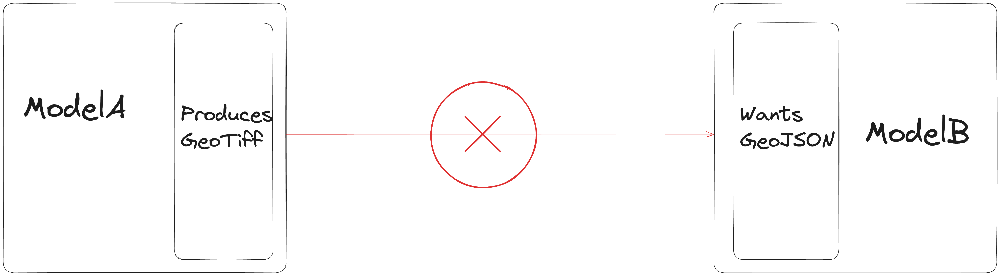
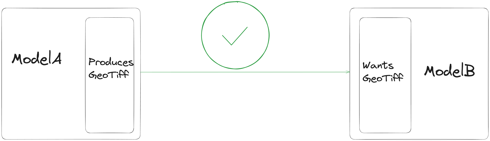

# Types

#### Why do we need `Types`?

You might be wondering, *why do we even need types? what is this additional layer of complexity? why should I learn one more thing?.* The answer kinda boils down to this,

> For models to work together and with each other, they need to speak the same language.

Since models are developed in silioes and as independent entities, *but* are expected to work with each other in connected chains, they need to have a common *dialect*, that they and the broader system understands. Using this *dialect*, the models specify their *inputs* and their *outputs*. Since all models and the system speak the same language, they can determine whether the output of one model can be compatible with the input of another model.

For example, if `ModelA` outputs a `GeoTiff` file and `ModelB` accepts a `GeoJSON` as input, they output of `ModelA` cannot be provided as input to `ModelB`, because well, they are of different `Types`.

But this works,

#### What do these `Types` mean?

??? abstract "TLDR"

    `Types` represent high-level concepts that mean something in the context of our platform and product. They may or may not coincide with programming constructs.

*Technically* Python doesn't have a *strong type system*. As a result, the language itself doesn't intrensically provide us with the ability to build types that represent higher level concepts.

Hence, we use [Pydantic's](https://docs.pydantic.dev/latest/) [Model Objects](https://docs.pydantic.dev/latest/concepts/models/) to create our Types.

!!! warning

    The user is not expected to interact with Pydantic's APIs with respect to Clay's Types, during usage.

These `Types` represent **high level** concepts that *mean something in the broader system*. Some types like [Rasters](#raster) and [Tabular](#tabular) are not programming concepts but are concepts that are relevant in the broader context of our product (1). On the other hand, types like [String](#string) and [Number](#number) have a meaning in programming constructs. It just so happens that, they also have a meaning in our broader product.

#### Supported `Types`

While this is the list of types we are starting with, we are very interested in including more types, if the model authors deem the necissity to include more types.

* **Raster** - *Used to represent GeoTIFFs*
* **Vector** - *Used to represent GeoJSONs*
* **Tabular** - *Used to represent tabular data*
* **Date** - *Used to represent dates*
* **Number** - *Used to represent numerical data*
* **String** - *Used to represent strings*

All the types are defined in `clay.types`. While each type might have some *properties* specific to it, they all share some common attributes. The common attributes are documented at [Common Attributes](#common-attributes). The entire list of types supported are mentioned in the subsequent [Fundamental Types](#fundamental-types) section.

Before we go ahead into the fundamental types, there are a few things we need to cover,

* Python as a language doesn't have a *strong type system*.
* Users **are recommended** to interact with the type systems only via the methods as defined in the documents. They ideally shouldn't attempt to directly manipulate type attributes. All interactions with the types should be via their `__init__` constructors as if they are just a class.

*

## Common Attributes

## Fundamental Types

### Raster
::: clay.types.Raster

### Vector
::: clay.types.Vector

### Tabular
::: clay.types.TabularProperties

### Date
::: clay.types.Date

### String
::: clay.types.String

### Number
::: clay.types.Number

## Type Properties

### RasterProperties
::: clay.types.RasterProperties

### VectorProperties
::: clay.types.VectorProperties

### TabularProperties
::: clay.types.TabularProperties

### DateProperties
::: clay.types.DateProperties
